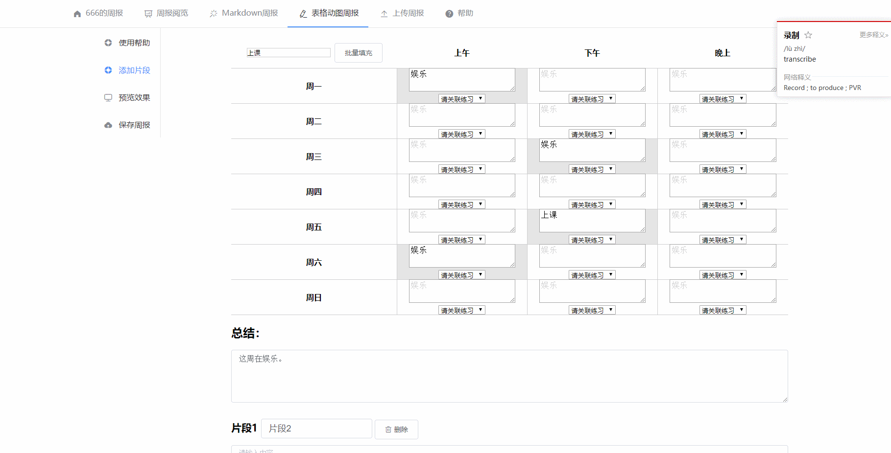

# zhoubao
一个用于研究生/博士/工作的每周工作汇报系统，springboot+vue+mysql。支持在线写周报、上传图片，支持pdf、markdown格式的周报文件。支持共享查看。

# 效果展示

## 登录界面

首页北京与bing.com图片同步,每天都有新鲜感。


## Markdown编辑器

支持在线使用Markdown语法写周报。


## 表格式周报与图片上传

支持以在线表格的形式填写每周工作情况，同时还支持上传图片进行说明。



# 部署方法

### 创建数据库

创建数据库，然后导入`zhoubao.sql`文件定义的结构。

### 创建阅览账号：用于分配给老师或领导

在user表中插入一条记录，user.type设置为1。为1表示是阅览账号，该类型账户目前可以阅览所有用户的周报。

### 填写数据库配置

只需修改位于`src\main\resources\application.yml`的配置：

```properties
#配置周报相关位置      
zhoubao:
	#周报存储位置
    location: D:/ipv6download/ 
    #周报数据库配置
    database-config: 
      #数据库名
      name: YourDatabaseName 
      #数据库用户
      username: username
      #数据库密码
      password: password
```

> ”spring:
>   profiles: prod“下边一段的配置用于prod环境（生产环境）的相应配置（在启动jar包时指定spring.profiles选项可进入prod环境，例如：
>
> `java -jar zhoubao.jar --spring.profiles.active=prod`）

## 启动项目

在ide中直接启动或者打包为jar后启动